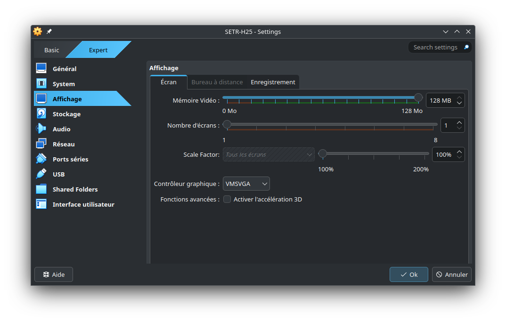

## 1. Objectifs

Ce travail pratique vise les objectifs suivants :

1. Mettre en place un environnement de développement complet;
2. Comprendre les mécanismes derrière la compilation croisée;
3. Maîtriser les rudiments du débogage et du profilage à distance;
4. Analyser et déboguer un code C simple;
5. Se familiariser avec l'utilisation du Raspberry Pi Zero W.


## 2. Préparation du Raspberry Pi

La carte MicroSD du kit qui vous a été fourni contient normalement déjà l'image système nécessaire au cours. Toutefois, dans le cas où vous recevez un kit avec une MicroSD non-initialisée, que vous voudriez revenir à l'état initial de l'image, ou simplement créer une copie, vous pouvez télécharger le fichier *.img* contenant l'[image du cours](http://wcours.gel.ulaval.ca/GIF3004/setrh24/imgh24-v2.zip). Ce fichier doit être copié en mode bas niveau sur une carte MicroSD d'une capacité d'au moins *32 GB* (par exemple en utilisant `dd` sous Linux, ou un programme tel que [Rufus](https://rufus.ie/en/) sur Windows).

La première des tâches à réaliser est de démarrer le Raspberry Pi Zero W, de mettre en place sa configuration initiale et de vous assurer de son bon fonctionnement. Par la suite, vous devrez installer sur votre ordinateur l'environnement de développement et de compilation croisée qui vous servira tout au long de la session. 

> **Important :** le Raspberry Pi étant un ordinateur à part entière, il est techniquement possible de n'utiliser que ce dernier et y travailler localement en se passant de l'environnement de développement à distance. Cela n'est toutefois pas représentatif du développement des systèmes embarqués en pratique, où il est souvent impossible de travailler directement sur le matériel cible, que ce soit par manque de puissance ou par d'autres problèmes pratiques (pensons par exemple à un Raspberry Pi embarqué dans un dispositif lourd et encombrant). De plus, pour beaucoup de travaux, la puissance limitée du Raspberry Pi Zero W et son nombre de ports limité rendraient malaisée une telle utilisation. Pour cette raison, dans le cadre du cours, *il vous est interdit d'utiliser le Raspberry Pi de cette manière*, sauf lorsque qu'expressément mentionné autrement dans un énoncé ou autorisé par le professeur.

### 2.1. Mot de passe

Insérez la carte MicroSD avec l'image du cours dans la fente prévue à cet effet sur le Raspberry Pi. Branchez un écran (une sortie HDMI est disponible, n'oubliez pas d'utiliser le convertisseur mini-HDMI vers HDMI) ainsi qu'un clavier (utilisez la prise USB _la plus proche du port HDMI_ pour brancher le clavier et la plus éloignée pour l'alimentation). Vous devrez d'abord vous authentifier avec le compte par défaut :

* **Nom d'utilisateur** : _pi_
* **Mot de passe** : _setrh2024_

Si tout s'est bien passé, vous devriez vous retrouver face à un écran vous demandant de changer votre mot de passe. Le mot de passe par défaut de l'image est "gif3004", nous vous recommandons fortement de le remplacer par un mot de passe plus sécuritaire (et personnel). Pour changer votre mot de passe manuellement, utilisez la commande `passwd` dans le terminal.

> **Important** : modifiez le mot de passe avant de vous connecter sur un réseau, sinon tout le monde pourra accéder à votre Raspberry Pi et son contenu!

### 2.2. Réseau sans fil

Ensuite, vous devez configurer votre Raspberry Pi pour qu'il se connecte au réseau sans fil.

#### 2.2.1. Eduroam

Si vous êtes sur le campus, nous vous suggérons d'utiliser Eduroam. Nous vous fournissons déjà un fichier de configuration pour ce réseau dans `/etc/NetworkManager/system-connections/eduroam.nmconnection`. Éditez ce fichier pour y ajouter votre IDUL et votre NIP, puis redémarrez le Raspberry Pi avec la commande `sudo reboot`. 

> Note : si vous n'êtes pas familier avec les éditeurs de texte en console, nous vous suggérons d'utiliser `nano` (par exemple, dans ce cas-ci, `sudo nano /etc/NetworkManager/system-connections/eduroam.nmconnection`). Une fois vos modifications effectuées, utilisez Ctrl+X pour quitter, puis Y (pour enregistrer vos modifications) et Enter (pour conserver le même nom de fichier). Si vous êtes familiers avec d'autres éditeurs, vous êtes évidemment libre de les utiliser.

#### 2.2.2. Votre propre réseau

Utilisez la commande `nmtui` dans le terminal et suivez les instructions. En général, il suffit de sélectionner `Activate a connection` ou `Edit connection` (dépendant des réseaux déjà enregistrés), puis de sélectionner le réseau sur lequel vous voulez vous connecter. Une fois la configuration terminée, la connexion devrait se faire dans les 15-20 secondes.

## 3. Installation de la machine virtuelle de développement

Ce cours requiert l'utilisation d'un système GNU/Linux. Dans le cadre du cours, vous avez deux options :

* Utiliser un des ordinateurs du laboratoire informatique 0105, sur lesquels les logiciels et outils nécessaires au cours sont pré-installés;
* Télécharger une machine virtuelle [VirtualBox](https://www.virtualbox.org/) à [l'adresse suivante](http://wcours.gel.ulaval.ca/GIF3004/setrh24/setrh2024.vdi.zip) (attention, téléchargement de 10GB). Le nom d'utilisateur est `setr` et le mot de passe `setrh2024`, vous n'avez pas accès à la commande `sudo`, mais pouvez passer en mode _root_ en utilisant `su`;
* Utiliser votre propre installation Linux, notez que nous ne pouvons dans ce cas garantir que les étapes d'installation et de configuration seront exactement les mêmes (vous pouvez passer à la section suivante si vous choisissez cette option).

> Note : nous offrons également [une version VMDK de l'image](http://wcours.gel.ulaval.ca/GIF3004/setrh24/setrh2024.zip), si vous souhaitez utiliser VMware. Dans ce cas, ne tenez pas directement compte des instructions suivantes (nous supposons que vous savez comment configurer VMware de manière similaire).

### 3.1. Lancement de la machine virtuelle

Commencez par décompresser le fichier setrh2024.vdi.zip téléchargé, il devrait contenir un unique fichier .vdi.
Pour importer la machine virtuelle dans VirtualBox, cliquez sur *Nouvelle*. 


Vous pouvez choisir le nom de la machine virtuelle, pour *Type* sélectionnez *Linux* et *Fedora (64bit)* pour *Version*. 


Dans la section _Hardware_, choisissez la mémoire et le nombre de CPU que vous allez allouer à la machine virtuelle (vous pourrez toujours ajuster plus tard au besoin). Nous vous recommandons au _minimum_ 2 processeurs et 4096 MB de RAM.


Dans la section _Hard Disk_, sélectionnez *Utiliser un fichier de disque dur virtuel existant* et choisissez le fichier .vdi en cliquant qur l'icône en forme de dossier. Cliquez sur "Terminer" pour compléter la configuration.


_Avant_ de démarrer la machine virtuelle, configurez sa mémoire vidéo en faisant *Clic-droit/Configuration...*. Dans l'onglet "Affichage", ajustez la mémoire vidéo à *128 MB* et sélectionnez *Activer l'accélération 3D*. Si vous observez des plantages ou que l'écran se fige, désactivez au contraire l'accélération 3D. Les transitions seront moins fluides mais la VM fonctionnera sans plantage. La configuration de base est alors normalement terminée, vous pouvez valider et lancer la VM.



> **Important**: la machine virtuelle Fedora est sensible aux fermetures inopinées. Assurez-vous de toujours éteindre correctement la VM (en utilisant bouton d'arrêt en haut à droite de l'écran de la VM) pour éviter tout problème de corruption de données qui vous forcerait à repartir de zéro. Si vous avez suffisamment d'espace disque, vous pouvez également prendre un _snapshot_ (cloner) la machine virtuelle une fois celle-ci configuré à l'issue de ce laboratoire, pour avoir une sauvegarde.


## 4. Configuration de la connexion à distance

### 4.1. Accès par SSH

Par la suite, redémarrez le Raspberry Pi et vérifiez que vous pouvez vous connecter à distance via [SSH](https://chrisjean.com/ssh-tutorial-for-ubuntu-linux/) en utilisant votre installation Linux (e.g., la machine virtuelle). Nous vous suggérons de mettre en place une authentification par clé publique, pour vous éviter de devoir réécrire le même mot de passe à chaque connexion :

```
# L'étape suivante est à effectuer sur votre machine virtuelle (PAS le Raspberry Pi) et n'est nécessaire que si vous n'avez pas déjà de clé SSH
$ ssh-keygen -t rsa -b 4096 -C "ecrivez_votre_nom_ici"
# Pressez 3 fois sur Enter (les choix par défaut sont bons)

# Cette étape est commune à toutes les installations, mais assurer-vous d'utiliser ici la bonne adresse
$ ssh-copy-id pi@adresse_ip_de_votre_raspberry_pi
```

> Si tout fonctionne à ce stade, vous ne devriez plus avoir à brancher un clavier sur votre Raspberry Pi, puisque vous pourrez l'administrer à distance avec SSH, qui vous offre le même terminal que celui natif du Raspberry Pi.

### 4.2. Configuration d'un résolveur DNS (optionnel)

Nous recommandons finalement l'installation et l'utilisation d'un résolveur DNS tel que [DuckDNS](http://duckdns.org) (gratuit), qui vous permettra de vous connecter plus facilement à votre Raspberry Pi en vous permettant d'utiliser un nom de domaine tel que "tarteauxframboises.duckdns.org" plutôt qu'une adresse IP pouvant potentiellement varier au fil de la session -- et qui vous forcera à brancher un écran pour l'obtenir.

Pour ce faire connectez-vous à [Duck DNS](https://www.duckdns.org). Créez un nom pour votre RPi.

Cependant, cette information n'est pas adéquate dans le contexte qui nous intéresse, comme on veut utiliser les adresses locales pour se connecter au RPi directement. Pour ce faire, nous avons déjà placé un [script shell](https://setr-ulaval.github.io/labo1-h24/etc/duckdns.sh) dans `/usr/local/bin/duckdns.sh` sur l'image de votre RPi, dont le contenu est le suivant :

```
#!/bin/bash
DUCKDNS_LOCALIP=`hostname -I`
DUCKDNS_TOKEN=ECRIRE VOTRE TOKEN DUCKDNS ICI
DUCKDNS_DOMAINS=ECRIRE VOTRE DOMAINS DUCKDNS ICI
DUCKDNS_LOGFILE=/var/log/duckdns.log
echo url="https://www.duckdns.org/update?domains=$DUCKDNS_DOMAINS&token=$DUCKDNS_TOKEN&ip=$DUCKDNS_LOCALIP" | curl -k -o $DUCKDNS_LOGFILE -K -
```

Changez les permissions permettant l'exécution du script avec la commande `sudo chmod +x /usr/local/bin/duckdns.sh`.

Éditez ce fichier (avec nano) en changeant les variables `DUCKDNS_TOKEN` et `DUCKDNS_DOMAINS` par ceux que vous obtenez dans les instructions pour le RPi du site de Duck DNS. Ensuite, vous pouvez éditer le fichier `/etc/rc.local` (i.e., `sudo nano /etc/rc.local`) pour y changer la varible `use_duckdns` à `True`. Redémarrez votre RPi, et vous devriez pouvoir vous y connecter en utilisant une adresse de type VOTREDOMAINE.duckdns.org.


## 5. Installation de l'environnement de compilation croisée

Le Raspberry Pi possède un processeur dont l'architecture (ARM) diffère de celle de votre ordinateur (x86-64). Vous ne pouvez donc pas directement transférer un exécutable compilé sur votre ordinateur. Il faut plutôt utiliser un environnement de _compilation croisée_, qui permettra à votre ordinateur de générer des binaires compatibles avec l'architecture ARM du Raspberry Pi. Pour mettre en place cet environnement, nous devrons (dans l'ordre) :

1. Installer [Crosstool-NG](https://crosstool-ng.github.io/), un outil nous permettant de créer des chaînes de compilation croisée;
2. Configurer Crosstool-NG selon les spécificités du Raspberry Pi Zero;
3. Compiler et installer l'environnement de compilation croisée sur votre ordinateur;
4. Synchroniser les librairies et en-têtes depuis le Raspberry Pi Zero;
5. Préparer une configuration CMake pour la compilation croisée.

Notez que la compilation de cet environnement peut prendre un certain temps. Cette installation doit être faite *que vous utilisiez ou non la machine virtuelle fournie*.


### 5.1. Installation de Crosstool-NG

Pour installer Crosstool-NG, récupérez d'abord la version utilisée dans le cours, puis exécutez le script `bootstrap` :

```
$ cd $HOME
$ wget http://crosstool-ng.org/download/crosstool-ng/crosstool-ng-1.26.0.tar.bz2
$ tar -xvf crosstool-ng-1.26.0.tar.bz2
$ cd crosstool-ng-1.26.0
$ ./bootstrap
```

> Note : un avertissement concernant `gl_HOST_CPU_C_ABI_32BIT` pourrait apparaître à la fin de l'exécution, il n'est pas important dans votre cas.

#### 5.1.1. Configuration et compilation de Crosstool-NG

Une fois la commande `./bootstrap` exécutée, en restant dans le même répertoire, utilisez `./configure` pour préparer la compilation et `make` pour le compiler :

```
$ ./configure --prefix=$HOME/crosstool-install
$ make && make install
```

Le paramètre _prefix_ indique l'endroit où les outils de Crosstool-NG doivent être installés. Vous devrez également ajouter ce chemin d'installation dans [votre variable d'environnement PATH](https://unix.stackexchange.com/questions/26047/how-to-correctly-add-a-path-to-path).  
* Si vous travaillez à l'aide de la machine virtuelle, cette configuration sera déjà faite.  
* Pour les ordinateurs du 0103/0105, vous devrez ajouter les 2 lignes suivante dans le fichier `~/.bashrc`
```
unset LD_LIBRARY_PATH
export PATH=$PATH:$HOME/crosstool-install/bin
```


> **Note** : il se peut que l'étape du `configure` échoue si vous effectuez l'installation sur votre ordinateur (sans utiliser la machine virtuelle du cours). Assurez-vous dans ce cas [d'avoir installé toutes les dépendances de Crosstool-NG](https://crosstool-ng.github.io/docs/os-setup/). Cette étape a déjà été effectuée pour vous sur les ordinateurs du lab ou avec la machine virtuelle fournie.


### 5.2. Configuration de l'environnement de compilation croisée

Nous allons maintenant préparer la compilation de l'environnement de compilation croisée (oui, c'est méta). Pour ce faire, Crosstool-NG a besoin d'informations sur notre système _cible_ (le Raspberry Pi). Créez tout d'abord un dossier nommé `ct-config-rpi-zero` dans votre dossier personnel et allez à l'intérieur :

```
$ cd $HOME
$ mkdir ct-config-rpi-zero
$ cd ct-config-rpi-zero
```

Au lieu de partir d'une configuration vide, nous allons utiliser en utiliser une spécialement préparée pour le cours. Dans le dossier `ct-config-rpi-zero`, téléchargez le fichier suivant et nommez le `.config` :

```
$ wget -O .config https://setr-ulaval.github.io/labo1-h24/etc/ct-ng-config
```


#### 5.2.1. Ajustement des chemins (paths)

La configuration telle que fournie est déjà prête à l'emploi **pour la machine virtuelle Fedora fournie**. Si vous utilisez un autre environnement (ex. votre propre installation Linux, les machines du 0103, etc.), vous **devez** la modifier afin d'éviter des problèmes qui vont entraîner des erreurs dans les prochains laboratoires!

> Cette sous-section n'est donc à effectuer _que si vous n'utilisez PAS_ la machine virtuelle fournie.

Pour se faire, lancez l'utilitaire de configuration de Crosstool-NG :

```
$ ct-ng menuconfig
```

Vous devriez alors obtenir une interface de ce type :


> **Important** : suivez _scrupuleusement_ les instructions suivantes. Tout manquement risque d'entraîner des erreurs ultérieures difficiles à interpréter et à corriger. Certains de ces changements peuvent avoir déjà été faits dépendant de la configuration de votre environnement. Si c'est le cas, laissez-les tels quel.

Allez dans la section _Paths and misc options_ et remplacez :

* _Prefix directory_ : `${HOME}/arm-cross-comp-env/${CT_TARGET}` (nous vous conseillons de conserver ce chemin, car les scripts de compilation fournis assument ce chemin précis)
<!-- * _Log to a file_ (tout en bas): désactivez l'option -->
<!--- * **Si vous utilisez un ordinateur du 0105** : Sur ces ordinateurs, il faut utiliser un dossier temporaire dédié et non pas l'espace de votre compte. Dans l'option _Working directory_. Remplacez donc `${CT_TOP_DIR}/.build` par `/gif3004/.build`.-->
<!--- * _Patches origin_ : `Bundled only` (**très important**, sinon vous vous retrouverez avec une longue suite d'erreurs à la compilation) -->


<!--- À droite, la configuration requise **sur un ordinateur du 0105**.-->
<!--- -->

<!--- Dans la section _C compiler_, remplacez les valeurs suivantes :

* _Version of gcc_ : `6.4.0`
* _Additional supported languages_ : assurez-vous que `C++` est coché
 * _Core gcc extra config_ : **retirer** `--with-arch=armv6` (autrement dit, doit contenir seulement `--with-float=hard --with-fpu=vfp`)
* _Gcc extra config_ : **retirer** `--with-arch=armv6` (autrement dit, doit contenir seulement `--with-float=hard --with-fpu=vfp`)

-->

<!---
Dans la section _Target options_, nous allons spécifier au compilateur les caractéristiques exactes du matériel, de manière à ce qu'il puisse optimiser au maximum le code binaire généré. Remplacez les valeurs suivantes :

* _Target archicture_ : `arm`
* _Emit assembly for CPU_ : `arm1176jz-s`


-->

Dans la section _Operating System_, remplacez :

* _Source of linux_ : `Custom location`
* Une fois l'étape précédente effectuée, _Custom location_ : `chemin vers les sources du kernel`

Dans la dernière étape, `chemin vers les sources du kernel` doit être le chemin absolu vers le dossier contenant les sources du noyau Linux utilisé sur le Raspberry Pi. Celui-ci peut-être situé à des endroits différents selon votre installation:

* Si vous travaillez *sur les ordinateurs du laboratoire 0103/0105*, le chemin est `/opt/linux-rpi-6.1.54-rt15` 
* Si vous travaillez *sur la machine virtuelle Fedora fournie*, le chemin est `/home/setr/rPi/linux-rpi-6.1.54-rt15` (c'est déjà la valeur par défaut)
* Si vous travaillez *sur votre propre ordinateur*, téléchargez [l'archive suivante](http://wcours.gel.ulaval.ca/GIF3004/setrh24/linux-rpi-6.1.54-rt15.patched.tar.gz), décompressez-la et indiquez son chemin absolu.

<!--- Dans la section _C-library_, remplacez :

* _C library_ : `glibc`
* _Version of glibc_ : `2.24`

Dans la section _Binary utilities_, remplacez :

* _Version of binutils_ : `2.28.1`
-->

<!-- Dans la section _Debug facilities_ :

* Activez `gdb` et `strace`
* Allez ensuite dans les options de configuration de `gdb` (la touche Espace active ou désactive, la touche Entrée permet d'entrer dans les options) et _désactivez_ l'élément `Enable python scripting`


-->

N'oubliez pas d'enregistrer votre configuration (utilisez les flèches horizontales du clavier pour vous déplacer dans le menu du bas) puis quittez l'utilitaire.


### 5.3. Compilation et installation de la chaîne de compilation

Utilisez la commande suivante pour lancer la compilation :

```
$ ct-ng build
```

Cette compilation peut prendre un bon moment (comptez au moins 30 minutes), dépendant de la puissance de votre ordinateur. Si vous utilisez une machine virtuelle, pensez à augmenter le nombre de processeurs alloués à celle-ci, puisque Crosstool-NG peut en tirer parti. Vous aurez également besoin d'une bonne connexion Internet.


#### 5.3.1. Validation du contenu de la chaîne de compilation

Une fois cela fait, le répertoire `~/arm-cross-comp-env` devrait contenir un dossier nommé `arm-raspbian-linux-gnueabi`. Dans ce dossier, vous retrouverez plusieurs choses, mais en particulier :

* `bin/`, qui contient des exécutables x86-64 capables de générer du code machine ARM. Assurez-vous que ce dossier soit dans votre chemin d'exécution (PATH). Lorsque nous voudrons compiler un programme vers un binaire ARM, nous n'utiliserons donc pas `gcc` (qui compilerait en x86-64), mais bien `arm-raspbian-linux-gnueabi-gcc`
* `arm-raspbian-linux-gnueabi/sysroot`, qui contient les librairies et en-têtes des librairies centrales au système (libc, binutils, etc.). C'est là que le compilateur et l'éditeur de liens iront chercher les informations dont ils ont besoin.

> Note : si votre répertoire `~/arm-cross-comp-env` contient plutôt un dossier nommé `arm-raspbian-linux-gnueabihf` (avec "hf" à la fin), ajoutez ce suffixe à tous les endroits où on mentionne "arm-raspbian-linux-gnueabi" à partir d'ici.

### 5.4. Synchronisation avec le Raspberry Pi

> **Important** : attendez que l'étape précédente soit _terminée sans erreurs_ avant de continuer.

À ce stade, vous êtes en possession d'une chaîne de compilation croisée. Il vous faut toutefois maintenant la synchroniser avec le Raspberry Pi, de manière à vous assurer que les versions des librairies et des en-têtes soient les mêmes lorsque vous compilerez (sur votre ordinateur) et exécuterez (sur le Raspberry Pi). Il va falloir synchroniser trois répertoires :

* /usr/lib et /lib, qui contiennent les librairies partagées (fichier .so) qui peuvent être utilisées par les programmes;
* /usr/include, qui contient les en-têtes de ces librairies (nécessaires pour la compilation);
* /opt, qui contient certains fichiers de configuration importants.

Pour synchroniser ces dossiers, nous allons utiliser `rsync`. Cet outil permet de faire des mises à jour _incrémentales_, c'est-à-dire que seules les différences sont transférées. Notez que vous devez modifier `adresse_ip_ou_nom_dhote` pour l'adresse ou le DNS de votre Raspberry Pi dans les commandes suivantes.

```
$ cd ~/arm-cross-comp-env/arm-raspbian-linux-gnueabi/arm-raspbian-linux-gnueabi
$ rsync -av --numeric-ids --exclude "*.ko" --exclude "*.fw" --exclude "/opt/vc/src" --delete pi@adresse_ip_ou_nom_dhote:{/lib,/opt} sysroot
$ rsync -av --numeric-ids --exclude "/usr/lib/.debug" --delete pi@adresse_ip_ou_nom_dhote:{/usr/lib,/usr/include} sysroot/usr
```

Il reste par la suite un petit problème à corriger. Beaucoup de fichiers sont en fait des _liens_, qui évitent de devoir stocker deux fois le même fichier inutilement. Toutefois, certains de ces liens sont _absolus_, c'est-à-dire qu'ils contiennent un chemin absolu. Vous pouvez constater ce problème en testant, par exemple :

```
$ ls -l sysroot/usr/lib/arm-linux-gnueabihf/libm.so 
lrwxrwxrwx 1 setr setr 34  3 oct 16:45 sysroot/usr/lib/arm-linux-gnueabihf/libm.so -> /lib/arm-linux-gnueabihf/libm.so.6
```

Comme on le voit, le lien pointe vers un chemin absolu, qui n'existe pas sur notre plateforme de compilation (votre terminal devrait d'ailleurs vous l'afficher en rouge). Il y a plusieurs solutions pour corriger ce problème, vous pouvez consulter [cette page](https://unix.stackexchange.com/questions/100918/convert-absolute-symlink-to-relative-symlink-with-simple-linux-command) pour en savoir plus, mais le plus simple est d'utiliser la commande suivante. Attention, le `find` doit être exécuté *dans* le répertoire _sysroot_, sinon les chemins ne seront pas convertis correctement!

```
$ cd ~/arm-cross-comp-env/arm-raspbian-linux-gnueabi/arm-raspbian-linux-gnueabi/sysroot
$ find . -lname '/*' | while read l ; do   echo ln -sf $(echo $(echo $l | sed 's|/[^/]*|/..|g')$(readlink $l) | sed 's/.....//') $l; done | sh
```

> Vous devrez effectuer cette synchronisation _à chaque fois_ que vous ajouterez une librairie ou mettrez à jour votre système sur le Raspberry Pi.

> Ignorez l'erreur éventuelle concernant `/usr/lib/ssl/certs/certs`, ce répertoire ne sera pas nécessaire dans le cadre du cours


## 6. Configuration de l'environnement de développement

Dans le cadre du cours, nous allons utiliser [Visual Studio Code](https://packages.microsoft.com/yumrepos/vscode/Packages/c/code-1.83.1-1696982959.el7.x86_64.rpm) (ci-après abbrévié VSC). Nous vous recommandons de ne pas utiliser une version plus récente que 1.83.1 (la version présente dans la VM et avec laquelle le laboratoire a été testée). Il n'y a toutefois pas de contre-indication particulière à utiliser une version plus récente, mais certaines options de configuration ou de débogage pourraient être différentes. Vous êtes par ailleurs libres d'utiliser un autre environnement de développement, à votre convenance, mais vous _devez obligatoirement_ travailler en compilation croisée (autrement dit, le binaire doit être compilé sur _votre_ ordinateur et non le Raspberry Pi, et vous devez être en mesure de déboguer à partir de votre ordinateur) et nous ne pourrons potentiellement pas vous aider si vous choisissez un autre logiciel.

### 6.1. Préparation d'une configuration CMake

[CMake](https://cmake.org/cmake/help/v3.27) est un outil permettant de mettre en place une chaîne de compilation efficace et portable. Nous allons l'utiliser dans le cadre du cours afin d'automatiser la compilation et l'édition de liens des TP. Pour ce faire, créez un nouveau fichier dans `arm-cross-comp-env/`, nommé `rpi-zero-w-toolchain.cmake` et insérez-y le contenu suivant :

```
# Identification du systeme cible
SET(CMAKE_SYSTEM_NAME Linux)
SET(CMAKE_SYSTEM_VERSION 6.1)
set(CMAKE_SYSTEM_PROCESSOR arm)

# Localisation du sysroot
set(CMAKE_SYSROOT $ENV{HOME}/arm-cross-comp-env/arm-raspbian-linux-gnueabi/arm-raspbian-linux-gnueabi/sysroot)

# Selection du compilateur
set(tools $ENV{HOME}/arm-cross-comp-env/arm-raspbian-linux-gnueabi)
set(CMAKE_C_COMPILER ${tools}/bin/arm-raspbian-linux-gnueabi-gcc)
set(CMAKE_CXX_COMPILER ${tools}/bin/arm-raspbian-linux-gnueabi-g++)

# On ajoute des options au compilateur pour lui indiquer ou aller chercher les librairies
SET(FLAGS "-Wl,-rpath-link,${CMAKE_SYSROOT}/opt/vc/lib -Wl,-rpath-link,${CMAKE_SYSROOT}/lib/arm-linux-gnueabihf -Wl,-rpath-link,${CMAKE_SYSROOT}/usr/lib/arm-linux-gnueabihf -Wl,-rpath-link,${CMAKE_SYSROOT}/usr/local/lib")
SET(CMAKE_CXX_FLAGS ${FLAGS} CACHE STRING "" FORCE)
SET(CMAKE_C_FLAGS ${FLAGS} CACHE STRING "" FORCE)

# Quoi aller chercher dans la sysroot (on ne veut pas aller chercher les programmes puisqu'ils sont
# compiles en ARM et ne peuvent donc etre directement executes sur un processeur x86)
set(CMAKE_FIND_ROOT_PATH_MODE_PROGRAM NEVER)
set(CMAKE_FIND_ROOT_PATH_MODE_LIBRARY ONLY)
set(CMAKE_FIND_ROOT_PATH_MODE_INCLUDE ONLY)
set(CMAKE_FIND_ROOT_PATH_MODE_PACKAGE ONLY)
```

Nous réutiliserons cette configuration générique pour tous les projets du cours. Nous verrons plus loin comment la lier aux dits projets.

### 6.2. Installer les extensions requises par VSC

Une fois VSC ouvert, sélectionnez l'interface de recherche des extensions en cliquant sur la cinquième icône dans la barre de gauche. Par la suite, recherchez l'extension "C/C++ Extension Pack" et installez le premier résultat. Faites de même pour l'extension "Native Debug":

 


> **Vous devez installer les extensions suivantes :** `C/C++ Extension Pack` et `Native Debug`. Les extensions `CMake` et `Cmake Tools` devraient avoir été installées automatiquement.


## 7. Configuration du projet du laboratoire

Nous allons maintenant configurer un nouveau projet pour ce laboratoire.

### 7.1. Création d'un nouveau projet

Sur VSC, les projets sont simplement des dossiers. Créez donc dans votre dossier personnel un nouveau dossier nommé _projets_ puis, dans celui-ci, clonez le dépôt Git suivant :

```
$ git clone https://github.com/setr-ulaval/labo1-h24.git
```

Rendez également le script `src/syncAndStartGDB.sh` exécutable :

```
$ chmod +x src/syncAndStartGDB.sh
```

Par la suite, dans VSC, allez dans `Fichier > Ouvrir un dossier` et sélectionnez _labo1-h24/src_. Vous devriez alors pouvoir accéder, via le menu de gauche, aux fichiers `tp1.c` et `CMakeLists.txt`.

> **Important** : ouvrez bien le dossier _src_ et non la racine (labo1-h24), sinon les scripts de configuration ne fonctionneront pas!

À l'ouverture d'un nouveau projet, VScode vous demande toujours si vous faites confiance au code que vous ouvrez. Assurez-vous de répondre oui et de cocher la case lui indiquant de faire également confiance au dossier parent, sinon le projet sera ouvert en mode limité.


Par la suite, quelques notifications apparaitront. Vous _devez_ configurer le projet à ce stade, en cliquant sur "Oui" à l'option "Voulez-vous configurer le projet src" :


Lorsque vous le faites, un menu s'ouvrira dans la portion supérieure de la fenêtre. **Assurez-vous de sélectionner "Unspecified" dans la liste des choix qui vous sont proposés** :


Par ailleurs, cliquez sur l'autre notification concernant la visibilité des options CMake et sélectionner "visible" dans le menu déroulant (cela n'est pas obligatoire, mais vous offre des raccourcis plus rapide pour compiler ou changer le mode de compilation) :


Une fois cela fait, vous devriez obtenir une sortie de terminal indiquant que CMake a terminé sa configuration avec succès (*Build files have been written to: ...*):


> À ce stade, validez également la version du compilateur utilisé par CMake. Si votre environnement est correctement configuré, elle **doit** être *12.3.0*, comme dans la capture d'écran ci-dessus. Si ce n'est pas le cas, c'est que vous avez fait une erreur durant la création de votre environnement et que les projets risquent de ne pas fonctionner.

<!--- #### Configuration des répertoires de recherche d'en-têtes

VSC (et son extension C/C++) fournit plusieurs utilitaires pour faciliter la programmation. Pour les utiliser au maximum, il faut indiquer à VSC où aller chercher les fichiers _headers_. Dans VSC, allez dans le menu `Afficher`, puis `Palette de commandes`. Dans la ligne d'édition qui apparaît en haut de l'écran, écrivez `C/Cpp` puis sélectionnez `C/Cpp: Edit Configurations`. Dans le fichier qui s'ouvre, repérez la section concernant Linux, puis, dans l'option "IncludePaths", ajoutez le chemin complet vers le répertoire `sysroot/usr/include`. Par exemple, si vous utilisez la machine virtuelle fournie, le fichier de configuration devrait ressembler à celui-ci :


-->

### 7.2. Compilation croisée

Il est maintenant temps de tester votre chaîne de compilation croisée. Dans VSC, allez dans le menu `Afficher`, puis `Palette de commandes`.

> Cette palette de commandes est la manière privilégiée d'interagir avec les outils de VSC. Dans la suite des énoncés, nous l'appelerons simplement "Palette". Vous gagnerez probablement du temps à mémoriser le raccourci clavier permettant de l'ouvrir (Ctrl-Shift-P dans la VM, par exemple)!

Dans la ligne d'édition qui apparaît en haut de l'écran, écrivez `CMake` (remarquez comment VSC modifie ses suggestions au fur et à mesure), puis sélectionnez `CMake Build`. 

> Il se peut que VSC vous demande alors de choisir entre `Debug`, `Release`, `MinSizeRel` et `RelWithDebInfo`. Pour le moment, sélectionnez `Debug`, mais sachez que `Release` pourra être fort utile lorsque vous aurez besoin du maximum de performance possible. Notez que vous pouvez également utiliser la touche F7 comme raccourci. Si la configuration par défaut est déjà à `Debug`, comme vous pouvez le voir dans la barre de statut en bas à gauche (et qu'il ne vous pose donc pas la question), vous n'avez pas à faire de manipulation supplémentaire.

Si la compilation se termine avec succès, vous devriez observer une sortie similaire à celle-ci :


Notez le *Build finished with exit code 0*, tout en bas, indiquant que la compilation s'est déroulée avec succès. Vous noterez que le compilateur produit plusieurs avertissements (*warnings*), qui ne sont pas des erreurs l'empêchant de compiler le programme, mais qui vous indique qu'il y a possiblement quelque chose qui cloche avec le code...


### 7.3. Exécution et débogage

Si la compilation se termine avec succès, vous pouvez maintenant passer à l'étape de l'exécution du programme. Ici, nous cherchons à exécuter le programme sur le Raspberry Pi, mais en vous permettant de voir sa sortie et de le contrôler depuis votre ordinateur. Nous vous fournissons des scripts permettant de configurer VSC à cet effet. Vous devez cependant préalablement configurer un paramètre important. Dans le fichier `.vscode/tasks.json`, remplacez `adresse_de_votre_raspberry_pi` par l'adresse (IP ou DNS) effective de votre Raspberry Pi. Faites de même dans le fichier `.vscode/launch.json`, en conservant toutefois le `:4567` qui suit l'adresse du Raspberry Pi.

Une fois cela fait, vous pouvez synchroniser l'exécutable et lancer le débogage en allant dans le menu _Déboguer_ puis _Lancer le débogage_ (la touche F5 est un raccourci plus rapide ayant le même effet). Après quelques secondes (le script utilise rsync pour synchroniser les fichiers vers le Raspberry Pi), l'interface de débogage devrait s'afficher et vous permettre de déboguer le programme à distance.

> Il est d'usage de mettre un point d'arrêt (_breakpoint_) au début de la fonction `main()`. Cela permet de s'assurer que le débogueur est bien lancé avant de commencer l'exécution du programme. Pour ajouter un point d'arrêt dans VScode, cliquez simplement à gauche d'un numéro de ligne; un petit cercle rouge devrait alors apparaître, indiquant la présence d'un point d'arrêt. Vous n'êtes évidemment pas limités à un seul point d'arrêt par programme!

#### 7.3.1. Entrée et sortie standard

**Note**: cette sous-section est optionnelle, mais elle contient des informations qui peuvent vous aider pour l'exécution et le débogage de vos programmes, non seulement pour ce premier laboratoire, mais aussi pour les suivants.

Lors du débogage, le programme s'exécute sur le Raspberry Pi et vous n'avez donc pas accès à STDIN ou STDOUT. Par défaut, STDOUT (c'est-à-dire la sortie standard du programme, celle qui est utilisée par exemple par `printf()` pour l'affichage) est _redirigé_ vers le fichier `/home/pi/capture_stdout`. Vous pouvez donc voir, _après l'exécution_ de votre programme, le texte qu'il a produit en lisant ce fichier. Il est également possible de faire en sorte de le voir en temps réel dans VScode, en lançant, dans un second terminal (utilisez l'icône "+", en bas à droite), la commande suivante :
```
ssh pi@adresse_ip_ou_nom_dhote_de_votre_raspberry_pi tail -f -s 0.5 /home/pi/capture-stdout
```

Cette commande va suivre les mises à jour du fichier `/home/pi/capture-stdout` à toutes les 0,5 seconde. Elle ne s'arrêtera toutefois pas automatiquement lorsque le débogage sera terminé, utilisez Ctrl-C pour le faire manuellement. La sortie _d'erreur_ standard (STDERR) est elle aussi capturée, mais dans le fichier `/home/pi/capture-stderr` cette fois.

En ce qui concerne STDIN (les entrées _reçues_ par le programme, à partir du clavier), vous pouvez simuler ces entrées en les mettant dans un fichier (par exemple `/home/pi/entree_programme`) et en modifiant le fichier `src/syncAndStartGDB.sh` pour remplacer `/dev/null` à la toute fin de la ligne par votre fichier. Par exemple :
```
# Le contenu orignal
ssh pi@$2 "rm -f /home/pi/capture-stdout; rm -f /home/pi/capture-stderr; nohup gdbserver :4567 /home/pi/projects/$bn/SETR_TP1 > /home/pi/capture-stdout 2> /home/pi/capture-stderr < /dev/null &"

# devient 
ssh pi@$2 "rm -f /home/pi/capture-stdout; rm -f /home/pi/capture-stderr; nohup gdbserver :4567 /home/pi/projects/$bn/SETR_TP1 > /home/pi/capture-stdout 2> /home/pi/capture-stderr < /home/pi/entree_programme &"
```

De cette manière, Linux va faire "comme si" vous aviez tapé au clavier le texte écrit dans le fichier `/home/pi/entree_programme` (en tenant compte des retours à la ligne comme des "Enter").

Finalement, une fois le développement du programme et de la chaîne de compilation croisée terminés, notez que vous pouvez exécuter le programme directement sur le Raspberry Pi, via SSH. Assurez-vous d'y copier préalablement la bonne version de votre programme `SETR_TP1`. Dans ce mode, vous n'aurez toutefois pas accès à un débogueur.


### 7.4. Correction des bogues

À ce stade, vous devriez être en mesure de lancer une session de débogage à distance sur le Raspberry Pi. Il est maintenant temps d'utiliser tout cela à bon escient! Le fichier qui vous est fourni **contient trois erreurs distinctes** en plus de générer plusieurs avertissements de la part du compilateur. Ces erreurs ne sont pas des erreurs de compilation, mais des erreurs de logique, qui empêchent le programme d'avoir le bon comportement -- et qui, comme vous le constaterez, le font planter. Vous devez les identifier et les corriger en utilisant le débogueur de VSC. Vous devez également pouvoir expliquer leur cause, de même que les corrections à apporter pour que le programme fonctionne correctement. 

Finalement, vous devez corriger le code de manière à ce que GCC ne renvoie plus *aucun* warning lors de la compilation (tout en conservant le fonctionnement du programme, bien entendu). Prenez l'habitude de lire et décortiquer les avertissements du compilateur; ceux-ci révèlent parfois des erreurs cachées (et c'est le cas ici...).


<!--- #### 5) Profilage

Une fois cela fait, vous devez *profiler* le programme. Pour ce faire, activez d'abord la sortie d'information de profilage en allant dans les options du projet :


Puis exécutez le programme. Cela devrait produire un fichier nommé *gmon.out* dans le répertoire $HOME du Raspberry Pi. Vous pouvez par la suite y accéder avec Eclipse (utilisez la *perspective Remote Systems*) et l'ouvrir afin de consulter les informations de profilage :


Au vu des résultats de profilage obtenus, pouvez-vous donner le nombre d'appels à la fonction de comparaison lorsque vous faites appel au tri par insertion (fonction *maFonctionDeTri*), avec les bogues corrigés?

Modifiez maintenant l'argument d'entrée, afin d'obtenir une initialisation de la liste différente, et refaites un profilage. Obtenez-vous des résultats différents? Pourquoi?-->


## 8. Modalités d'évaluation

Ce travail est **individuel**. Aucun rapport n'est à remettre, mais vous devez être en mesure de démontrer que votre environnement de développement est fonctionnel et que vous savez utiliser ses fonctions basiques lors d'une évaluation en personne au PLT-0103. Cette évaluation sera faite lors des séances de laboratoire du **2 février 2024**. Ce travail compte pour **6%** de la note totale du cours.

Le barême d'évaluation détaillé sera le suivant (laboratoire noté sur 20 pts):

* (3 pts) Raspberry Pi fonctionnel, y compris à distance (via SSH);
* (7 pts) Chaîne de compilation croisée correctement construite et installée dans `$HOME/arm-cross-comp-env`, capacité à produire un binaire ARM;
* (2 pts) Visual Studio Code installé et fonctionnel, débogage à distance utilisable;
* (6 pts) Programme débogué: le programme doit *s'exécuter sans erreur et produire un résultat correct*. L'étudiant doit pouvoir expliquer les raisons des erreurs dans le programme initial;
* (2 pts) Programme corrigé: le programme doit pouvoir être compilé sans générer *aucun warning* et ce en produisant toujours un résultat correct.


## 9. Ressources et lectures connexes

* [Duck DNS](https://www.duckdns.org/)
* La [documentation de Raspbian](https://www.raspbian.org/RaspbianDocumentation), la distribution Linux sur laquelle est basée l'image du cours.
* La [documentation de GCC](https://gcc.gnu.org/onlinedocs/gcc/Warning-Options.html) à propos des messages d'avertissement.
* La [documentation de CrossTool-NG](https://crosstool-ng.github.io/docs/), que nous utilisons pour générer la chaîne de compilation.
* La [documentation de Visual Studio Code](https://code.visualstudio.com/docs), que vous pouvez parcourir pour trouver des fonctionnalités intéressantes et pratiques pour les prochains laboratoires
