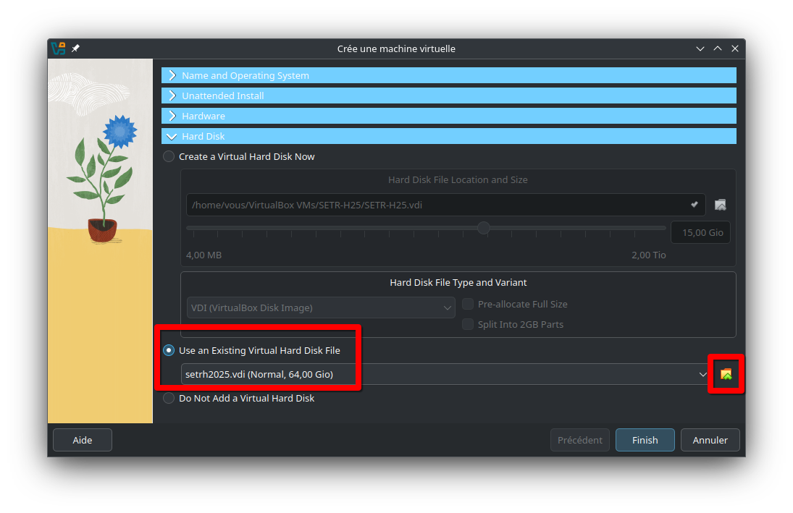

## 1. Objectifs

Ce travail pratique vise les objectifs suivants :

1. Mettre en place un environnement de développement complet;
2. Comprendre les mécanismes derrière la compilation croisée;
3. Maîtriser les rudiments du débogage et du profilage à distance;
4. Analyser et déboguer un code C simple;
5. Se familiariser avec l'utilisation du Raspberry Pi Zero W.


## 2. Préparation du Raspberry Pi

La carte MicroSD du kit qui vous a été fourni contient normalement déjà l'image système nécessaire au cours. Toutefois, dans le cas où vous recevez un kit avec une MicroSD non-initialisée, que vous voudriez revenir à l'état initial de l'image, ou simplement créer une copie, vous pouvez télécharger le fichier *.img* contenant l'[image du cours](http://wcours.gel.ulaval.ca/GIF3004/setrh25/imgh25.zip). Ce fichier doit être copié en mode bas niveau sur une carte MicroSD d'une capacité d'au moins *32 GB* (par exemple en utilisant `dd` sous Linux, ou un programme tel que [Rufus](https://rufus.ie/en/) sur Windows).

La première des tâches à réaliser est de démarrer le Raspberry Pi Zero W, de mettre en place sa configuration initiale et de vous assurer de son bon fonctionnement. Par la suite, vous devrez installer sur votre ordinateur l'environnement de développement et de compilation croisée qui vous servira tout au long de la session. 

> **Important :** le Raspberry Pi étant un ordinateur à part entière, il est techniquement possible de n'utiliser que ce dernier et y travailler localement en se passant de l'environnement de développement à distance. Cela n'est toutefois pas représentatif du développement des systèmes embarqués en pratique, où il est souvent impossible de travailler directement sur le matériel cible, que ce soit par manque de puissance ou par d'autres problèmes pratiques (pensons par exemple à un Raspberry Pi embarqué dans un dispositif lourd et encombrant). De plus, pour beaucoup de travaux, la puissance limitée du Raspberry Pi Zero W et son nombre de ports limité rendraient malaisée une telle utilisation. Pour cette raison, dans le cadre du cours, *il vous est interdit d'utiliser le Raspberry Pi de cette manière*, sauf lorsque qu'expressément mentionné autrement dans un énoncé ou autorisé par le professeur.

### 2.1. Mot de passe

Insérez la carte MicroSD avec l'image du cours dans la fente prévue à cet effet sur le Raspberry Pi. Branchez un écran (une sortie HDMI est disponible, n'oubliez pas d'utiliser le convertisseur mini-HDMI vers HDMI) ainsi qu'un clavier (utilisez la prise USB _la plus proche du port HDMI_ pour brancher le clavier et la plus éloignée pour l'alimentation). Vous devrez d'abord vous authentifier avec le compte par défaut :

* **Nom d'utilisateur** : _pi_
* **Mot de passe** : _setrh2025_

Si tout s'est bien passé, vous devriez vous retrouver face à un écran vous demandant de changer votre mot de passe. Le mot de passe par défaut de l'image est "gif3004", nous vous recommandons fortement de le remplacer par un mot de passe plus sécuritaire (et personnel). Pour changer votre mot de passe manuellement, utilisez la commande `passwd` dans le terminal.

> **Important** : modifiez le mot de passe avant de vous connecter sur un réseau, sinon tout le monde pourra accéder à votre Raspberry Pi et son contenu!

### 2.2. Réseau sans fil

Ensuite, vous devez configurer votre Raspberry Pi pour qu'il se connecte au réseau sans fil.

#### 2.2.1. Eduroam

Si vous êtes sur le campus, nous vous suggérons d'utiliser Eduroam. Nous vous fournissons déjà un fichier de configuration pour ce réseau dans `/etc/NetworkManager/system-connections/eduroam.nmconnection`. Éditez ce fichier pour y ajouter votre IDUL et votre NIP, puis redémarrez le Raspberry Pi avec la commande `sudo reboot`. 

> Note : si vous n'êtes pas familier avec les éditeurs de texte en console, nous vous suggérons d'utiliser `nano` (par exemple, dans ce cas-ci, `sudo nano /etc/NetworkManager/system-connections/eduroam.nmconnection`). Une fois vos modifications effectuées, utilisez Ctrl+X pour quitter, puis Y (pour enregistrer vos modifications) et Enter (pour conserver le même nom de fichier). Si vous êtes familiers avec d'autres éditeurs, vous êtes évidemment libre de les utiliser.

> Note : certains lieux sur le campus (incluant les résidences) utilisent maintenant un nouveau réseau nommé `eduroam2`. Si vous voulez que votre Raspberry Pi puisse se connecter aussi à ce réseau, éditez le fichier `/etc/NetworkManager/system-connections/eduroam2.nmconnection` de la même manière que vous avez fait pour le fichier `eduroam.nmconnection`.

#### 2.2.2. Votre propre réseau

Utilisez la commande `nmtui` dans le terminal et suivez les instructions. En général, il suffit de sélectionner `Activate a connection` ou `Edit connection` (dépendant des réseaux déjà enregistrés), puis de sélectionner le réseau sur lequel vous voulez vous connecter. Une fois la configuration terminée, la connexion devrait se faire dans les 15-20 secondes.

> Note : si, sur votre propre réseau, vous observez des lenteurs anormales ou des déconnexions fréquentes dans vos connexions SSH (ex. lors de vos sessions de débogage), essayez d'ajouter la ligne `IPQoS cs0 cs0` à la fin du fichier `/etc/ssh/sshd_config`. Voyez [cette page](https://discourse.osmc.tv/t/solved-ssh-connection-sometimes-hangs/76504) pour plus d'informations.

## 3. Installation de la machine virtuelle de développement

Ce cours requiert l'utilisation d'un système GNU/Linux. Nous vous suggérons _fortement_ d'utiliser la machine virtuelle Fedora (format VirtualBox) préparée pour le cours et disponible à [l'adresse suivante](http://wcours.gel.ulaval.ca/GIF3004/setrh25/setrh2025.zip) (attention, téléchargement de 10GB). Le nom d'utilisateur est `setr` et le mot de passe `setrh2025`, vous n'avez pas accès à la commande `sudo`, mais pouvez passer en mode _root_ en utilisant `su`. Nous expliquons à la section 3.1 comment la paramétrer.

Vous pouvez également utiliser un des ordinateurs  du laboratoire informatique 0105, sur lesquels les logiciels et outils nécessaires au cours sont pré-installés. Vous devrez toutefois télécharger [cette archive](http://wcours.gel.ulaval.ca/GIF3004/setrh25/crosstool-ng_package_vm_2025.tar.xz) et la placer dans votre répertoire personnel.

Finalement, vous êtes libres d'utiliser votre propre installation _Linux_. Notez toutefois que nous ne pourrons vous offrir de support sur sa configuration et que vous devrez bâtir vous-mêmes l'environnement de compilation croisée.


### 3.1. Lancement de la machine virtuelle

Commencez par décompresser le fichier setrh2025.vdi.zip téléchargé, il devrait contenir un unique fichier .vdi.
Pour importer la machine virtuelle dans VirtualBox, cliquez sur *Nouvelle*. 


Vous pouvez choisir le nom de la machine virtuelle, pour *Type* sélectionnez *Linux* et *Fedora (64bit)* pour *Version*. 


Dans la section _Hardware_, choisissez la mémoire et le nombre de CPU que vous allez allouer à la machine virtuelle (vous pourrez toujours ajuster plus tard au besoin). Nous vous recommandons au _minimum_ 2 processeurs et 4096 MB de RAM.


Dans la section _Hard Disk_, sélectionnez *Utiliser un fichier de disque dur virtuel existant* et choisissez le fichier .vdi (provenant de l'archive décompressée) en cliquant qur l'icône en forme de dossier. Cliquez sur "Terminer" pour compléter la configuration.



_Avant_ de démarrer la machine virtuelle, configurez sa mémoire vidéo en faisant *Clic-droit/Configuration...*. Dans l'onglet "Affichage", ajustez la mémoire vidéo à *128 MB* et assurez vous que *Activer l'accélération 3D* est _désactivé_. La configuration de base est alors normalement terminée, vous pouvez valider et lancer la VM.


> **Important**: la machine virtuelle Fedora est sensible aux fermetures inopinées. Assurez-vous de toujours éteindre correctement la VM (en utilisant bouton d'arrêt en haut à droite de l'écran de la VM) pour éviter tout problème de corruption de données qui vous forcerait à repartir de zéro. Si vous avez suffisamment d'espace disque, vous pouvez également prendre un _snapshot_ (cloner) la machine virtuelle une fois celle-ci configuré à l'issue de ce laboratoire, pour avoir une sauvegarde.


## 4. Configuration de la connexion à distance

### 4.1. Accès par SSH

Par la suite, redémarrez le Raspberry Pi et vérifiez que vous pouvez vous connecter à distance via [SSH](https://chrisjean.com/ssh-tutorial-for-ubuntu-linux/) en utilisant votre installation Linux (e.g., la machine virtuelle). Nous vous suggérons de mettre en place une authentification par clé publique, pour vous éviter de devoir réécrire le même mot de passe à chaque connexion :

```
# L'étape suivante est à effectuer sur votre machine virtuelle (PAS le Raspberry Pi) et n'est nécessaire que si vous n'avez pas déjà de clé SSH
$ ssh-keygen -t rsa -b 4096 -C "ecrivez_votre_nom_ici"
# Pressez 3 fois sur Enter (les choix par défaut sont bons)

# Cette étape est commune à toutes les installations, mais assurer-vous d'utiliser ici la bonne adresse
$ ssh-copy-id pi@adresse_ip_de_votre_raspberry_pi
```

> Si tout fonctionne à ce stade, vous ne devriez plus avoir à brancher un clavier sur votre Raspberry Pi, puisque vous pourrez l'administrer à distance avec SSH, qui vous offre le même terminal que celui natif du Raspberry Pi.

### 4.2. Configuration d'un résolveur DNS (optionnel)

Nous recommandons finalement l'installation et l'utilisation d'un résolveur DNS tel que [DuckDNS](http://duckdns.org) (gratuit), qui vous permettra de vous connecter plus facilement à votre Raspberry Pi en vous permettant d'utiliser un nom de domaine tel que "tarteauxframboises.duckdns.org" plutôt qu'une adresse IP pouvant potentiellement varier au fil de la session -- et qui vous forcera à brancher un écran pour l'obtenir.

Pour ce faire connectez-vous à [Duck DNS](https://www.duckdns.org). Créez un nom pour votre RPi.

Cependant, cette information n'est pas adéquate dans le contexte qui nous intéresse, comme on veut utiliser les adresses locales pour se connecter au RPi directement. Pour ce faire, nous avons déjà placé un [script shell](https://setr-ulaval.github.io/labo1-h24/etc/duckdns.sh) dans `/usr/local/bin/duckdns.sh` sur l'image de votre RPi, dont le contenu est le suivant :

```
#!/bin/bash
DUCKDNS_LOCALIP=`hostname -I`
DUCKDNS_TOKEN=ECRIRE VOTRE TOKEN DUCKDNS ICI
DUCKDNS_DOMAINS=ECRIRE VOTRE DOMAINS DUCKDNS ICI
DUCKDNS_LOGFILE=/var/log/duckdns.log
echo url="https://www.duckdns.org/update?domains=$DUCKDNS_DOMAINS&token=$DUCKDNS_TOKEN&ip=$DUCKDNS_LOCALIP" | curl -k -o $DUCKDNS_LOGFILE -K -
```

Changez les permissions permettant l'exécution du script avec la commande `sudo chmod +x /usr/local/bin/duckdns.sh`.

Éditez ce fichier (avec nano) en changeant les variables `DUCKDNS_TOKEN` et `DUCKDNS_DOMAINS` par ceux que vous obtenez du site de Duck DNS. Ensuite, vous pouvez activer l'envoi automatique au démarrage en exécutant la commande `sudo systemctl enable updateIP.service`. Redémarrez votre RPi, et vous devriez pouvoir vous y connecter en utilisant une adresse de type VOTREDOMAINE.duckdns.org.


## 5. Configuration de l'environnement de développement

Dans le cadre du cours, nous allons utiliser [Visual Studio Code](https://packages.microsoft.com/yumrepos/vscode/Packages/c/code-1.83.1-1696982959.el7.x86_64.rpm) (ci-après abbrévié VSC). Nous vous recommandons de ne pas utiliser une version plus récente que 1.83.1 (la version présente dans la VM et avec laquelle le laboratoire a été testée). Il n'y a toutefois pas de contre-indication particulière à utiliser une version plus récente, mais certaines options de configuration ou de débogage pourraient être différentes. Vous êtes par ailleurs libres d'utiliser un autre environnement de développement, à votre convenance, mais vous _devez obligatoirement_ travailler en compilation croisée (autrement dit, le binaire doit être compilé sur _votre_ ordinateur et non le Raspberry Pi, et vous devez être en mesure de déboguer à partir de votre ordinateur) et nous ne pourrons potentiellement pas vous aider si vous choisissez un autre logiciel.


### 5.1. Installer les extensions requises par VSC

Une fois VSC ouvert, sélectionnez l'interface de recherche des extensions en cliquant sur la cinquième icône dans la barre de gauche. Par la suite, recherchez l'extension "C/C++ Extension Pack" et installez le premier résultat. Faites de même pour l'extension "Native Debug":

 


> **Vous devez installer les extensions suivantes :** `C/C++ Extension Pack` et `Native Debug`. Les extensions `CMake` et `Cmake Tools` devraient avoir été installées automatiquement.


## 6. Configuration du projet du laboratoire

Nous allons maintenant configurer un nouveau projet pour ce laboratoire.

### 6.1. Création d'un nouveau projet

Sur VSC, les projets sont simplement des dossiers. Créez donc dans votre dossier personnel un nouveau dossier nommé _projets_ puis, dans celui-ci, clonez le dépôt Git suivant :

```
$ git clone https://github.com/setr-ulaval/labo1-h25.git
```

Rendez également le script `src/syncAndStartGDB.sh` exécutable :

```
$ chmod +x src/syncAndStartGDB.sh
```

Par la suite, dans VSC, allez dans `Fichier > Ouvrir un dossier` et sélectionnez _labo1-h25/src_. Vous devriez alors pouvoir accéder, via le menu de gauche, aux fichiers `tp1.c` et `CMakeLists.txt`.

> **Important** : ouvrez bien le dossier _src_ et non la racine (labo1-h24), sinon les scripts de configuration ne fonctionneront pas!

À l'ouverture d'un nouveau projet, VScode vous demande toujours si vous faites confiance au code que vous ouvrez. Assurez-vous de répondre oui et de cocher la case lui indiquant de faire également confiance au dossier parent, sinon le projet sera ouvert en mode limité.


Par la suite, quelques notifications apparaitront. Vous _devez_ configurer le projet à ce stade, en cliquant sur "Oui" à l'option "Voulez-vous configurer le projet src" :


Lorsque vous le faites, un menu s'ouvrira dans la portion supérieure de la fenêtre. **Assurez-vous de sélectionner "Unspecified" dans la liste des choix qui vous sont proposés** :


Par ailleurs, cliquez sur l'autre notification concernant la visibilité des options CMake et sélectionner "visible" dans le menu déroulant (cela n'est pas obligatoire, mais vous offre des raccourcis plus rapide pour compiler ou changer le mode de compilation) :


Une fois cela fait, vous devriez obtenir une sortie de terminal indiquant que CMake a terminé sa configuration avec succès (*Build files have been written to: ...*):


> À ce stade, validez également la version du compilateur utilisé par CMake. Si votre environnement est correctement configuré, elle **doit** être *12.3.0*, comme dans la capture d'écran ci-dessus. Si ce n'est pas le cas, c'est que vous avez fait une erreur durant la création de votre environnement et que les projets risquent de ne pas fonctionner.

<!--- #### Configuration des répertoires de recherche d'en-têtes

VSC (et son extension C/C++) fournit plusieurs utilitaires pour faciliter la programmation. Pour les utiliser au maximum, il faut indiquer à VSC où aller chercher les fichiers _headers_. Dans VSC, allez dans le menu `Afficher`, puis `Palette de commandes`. Dans la ligne d'édition qui apparaît en haut de l'écran, écrivez `C/Cpp` puis sélectionnez `C/Cpp: Edit Configurations`. Dans le fichier qui s'ouvre, repérez la section concernant Linux, puis, dans l'option "IncludePaths", ajoutez le chemin complet vers le répertoire `sysroot/usr/include`. Par exemple, si vous utilisez la machine virtuelle fournie, le fichier de configuration devrait ressembler à celui-ci :


-->

### 6.2. Compilation croisée

Il est maintenant temps de tester votre chaîne de compilation croisée. Dans VSC, allez dans le menu `Afficher`, puis `Palette de commandes`.

> Cette palette de commandes est la manière privilégiée d'interagir avec les outils de VSC. Dans la suite des énoncés, nous l'appelerons simplement "Palette". Vous gagnerez probablement du temps à mémoriser le raccourci clavier permettant de l'ouvrir (Ctrl-Shift-P dans la VM, par exemple)!

Dans la ligne d'édition qui apparaît en haut de l'écran, écrivez `CMake` (remarquez comment VSC modifie ses suggestions au fur et à mesure), puis sélectionnez `CMake Build`. 

> Il se peut que VSC vous demande alors de choisir entre `Debug`, `Release`, `MinSizeRel` et `RelWithDebInfo`. Pour le moment, sélectionnez `Debug`, mais sachez que `Release` pourra être fort utile lorsque vous aurez besoin du maximum de performance possible. Notez que vous pouvez également utiliser la touche F7 comme raccourci. Si la configuration par défaut est déjà à `Debug`, comme vous pouvez le voir dans la barre de statut en bas à gauche (et qu'il ne vous pose donc pas la question), vous n'avez pas à faire de manipulation supplémentaire.

Si la compilation se termine avec succès, vous devriez observer une sortie similaire à celle-ci :


Notez le *Build finished with exit code 0*, tout en bas, indiquant que la compilation s'est déroulée avec succès. Vous noterez que le compilateur produit plusieurs avertissements (*warnings*), qui ne sont pas des erreurs l'empêchant de compiler le programme, mais qui vous indique qu'il y a possiblement quelque chose qui cloche avec le code...


### 6.3. Exécution et débogage

Si la compilation se termine avec succès, vous pouvez maintenant passer à l'étape de l'exécution du programme. Ici, nous cherchons à exécuter le programme sur le Raspberry Pi, mais en vous permettant de voir sa sortie et de le contrôler depuis votre ordinateur. Nous vous fournissons des scripts permettant de configurer VSC à cet effet. Vous devez cependant préalablement configurer un paramètre important. Dans le fichier `.vscode/tasks.json`, remplacez `adresse_de_votre_raspberry_pi` par l'adresse (IP ou DNS) effective de votre Raspberry Pi. Faites de même dans le fichier `.vscode/launch.json`, en conservant toutefois le `:4567` qui suit l'adresse du Raspberry Pi.

Une fois cela fait, vous pouvez synchroniser l'exécutable et lancer le débogage en allant dans le menu _Déboguer_ puis _Lancer le débogage_ (la touche F5 est un raccourci plus rapide ayant le même effet). Après quelques secondes (le script utilise rsync pour synchroniser les fichiers vers le Raspberry Pi), l'interface de débogage devrait s'afficher et vous permettre de déboguer le programme à distance.

> Il est d'usage de mettre un point d'arrêt (_breakpoint_) au début de la fonction `main()`. Cela permet de s'assurer que le débogueur est bien lancé avant de commencer l'exécution du programme. Pour ajouter un point d'arrêt dans VScode, cliquez simplement à gauche d'un numéro de ligne; un petit cercle rouge devrait alors apparaître, indiquant la présence d'un point d'arrêt. Vous n'êtes évidemment pas limités à un seul point d'arrêt par programme!

#### 6.3.1. Entrée et sortie standard

**Note**: cette sous-section est optionnelle, mais elle contient des informations qui peuvent vous aider pour l'exécution et le débogage de vos programmes, non seulement pour ce premier laboratoire, mais aussi pour les suivants.

Lors du débogage, le programme s'exécute sur le Raspberry Pi et vous n'avez donc pas accès à STDIN ou STDOUT. Par défaut, STDOUT (c'est-à-dire la sortie standard du programme, celle qui est utilisée par exemple par `printf()` pour l'affichage) est _redirigé_ vers le fichier `/home/pi/capture_stdout`. Vous pouvez donc voir, _après l'exécution_ de votre programme, le texte qu'il a produit en lisant ce fichier. Il est également possible de faire en sorte de le voir en temps réel dans VScode, en lançant, dans un second terminal (utilisez l'icône "+", en bas à droite), la commande suivante :
```
ssh pi@adresse_ip_ou_nom_dhote_de_votre_raspberry_pi tail -f -s 0.5 /home/pi/capture-stdout
```

Cette commande va suivre les mises à jour du fichier `/home/pi/capture-stdout` à toutes les 0,5 seconde. Elle ne s'arrêtera toutefois pas automatiquement lorsque le débogage sera terminé, utilisez Ctrl-C pour le faire manuellement. La sortie _d'erreur_ standard (STDERR) est elle aussi capturée, mais dans le fichier `/home/pi/capture-stderr` cette fois.

En ce qui concerne STDIN (les entrées _reçues_ par le programme, à partir du clavier), vous pouvez simuler ces entrées en les mettant dans un fichier (par exemple `/home/pi/entree_programme`) et en modifiant le fichier `src/syncAndStartGDB.sh` pour remplacer `/dev/null` à la toute fin de la ligne par votre fichier. Par exemple :
```
# Le contenu orignal
ssh pi@$2 "rm -f /home/pi/capture-stdout; rm -f /home/pi/capture-stderr; nohup gdbserver :4567 /home/pi/projects/$bn/SETR_TP1 > /home/pi/capture-stdout 2> /home/pi/capture-stderr < /dev/null &"

# devient 
ssh pi@$2 "rm -f /home/pi/capture-stdout; rm -f /home/pi/capture-stderr; nohup gdbserver :4567 /home/pi/projects/$bn/SETR_TP1 > /home/pi/capture-stdout 2> /home/pi/capture-stderr < /home/pi/entree_programme &"
```

De cette manière, Linux va faire "comme si" vous aviez tapé au clavier le texte écrit dans le fichier `/home/pi/entree_programme` (en tenant compte des retours à la ligne comme des "Enter").

Finalement, une fois le développement du programme et de la chaîne de compilation croisée terminés, notez que vous pouvez exécuter le programme directement sur le Raspberry Pi, via SSH. Assurez-vous d'y copier préalablement la bonne version de votre programme `SETR_TP1`. Dans ce mode, vous n'aurez toutefois pas accès à un débogueur.


### 6.4. Correction des bogues

À ce stade, vous devriez être en mesure de lancer une session de débogage à distance sur le Raspberry Pi. Il est maintenant temps d'utiliser tout cela à bon escient! Le fichier qui vous est fourni **contient trois erreurs distinctes** en plus de générer plusieurs avertissements de la part du compilateur. Ces erreurs ne sont pas des erreurs de compilation, mais des erreurs de logique, qui empêchent le programme d'avoir le bon comportement -- et qui, comme vous le constaterez, le font planter. Vous devez les identifier et les corriger en utilisant le débogueur de VSC. Vous devez également pouvoir expliquer leur cause, de même que les corrections à apporter pour que le programme fonctionne correctement. 

Finalement, vous devez corriger le code de manière à ce que GCC ne renvoie plus *aucun* warning lors de la compilation (tout en conservant le fonctionnement du programme, bien entendu). Prenez l'habitude de lire et décortiquer les avertissements du compilateur; ceux-ci révèlent parfois des erreurs cachées (et c'est le cas ici...).


## 7. Modalités d'évaluation

Ce travail est **individuel**. Aucun rapport n'est à remettre, mais vous devez être en mesure de démontrer que votre environnement de développement est fonctionnel et que vous savez utiliser ses fonctions basiques lors d'une évaluation en personne au PLT-0103. Cette évaluation sera faite lors des séances de laboratoire du **31 janvier 2025**. Ce travail compte pour **4%** de la note totale du cours.

Le barême d'évaluation détaillé sera le suivant (laboratoire noté sur 20 pts):

* (3 pts) Raspberry Pi fonctionnel, y compris à distance (via SSH);
* (7 pts) Chaîne de compilation croisée correctement construite et installée dans `$HOME/arm-cross-comp-env`, capacité à produire un binaire ARM;
* (2 pts) Visual Studio Code installé et fonctionnel, débogage à distance utilisable;
* (6 pts) Programme débogué: le programme doit *s'exécuter sans erreur et produire un résultat correct*. L'étudiant doit pouvoir expliquer les raisons des erreurs dans le programme initial;
* (2 pts) Programme corrigé: le programme doit pouvoir être compilé sans générer *aucun warning* et ce en produisant toujours un résultat correct.


## 8. Ressources et lectures connexes

* [Duck DNS](https://www.duckdns.org/)
* La [documentation de Raspbian](https://www.raspbian.org/RaspbianDocumentation), la distribution Linux sur laquelle est basée l'image du cours.
* La [documentation de GCC](https://gcc.gnu.org/onlinedocs/gcc/Warning-Options.html) à propos des messages d'avertissement.
* La [documentation de CrossTool-NG](https://crosstool-ng.github.io/docs/), que nous utilisons pour générer la chaîne de compilation.
* La [documentation de Visual Studio Code](https://code.visualstudio.com/docs), que vous pouvez parcourir pour trouver des fonctionnalités intéressantes et pratiques pour les prochains laboratoires
